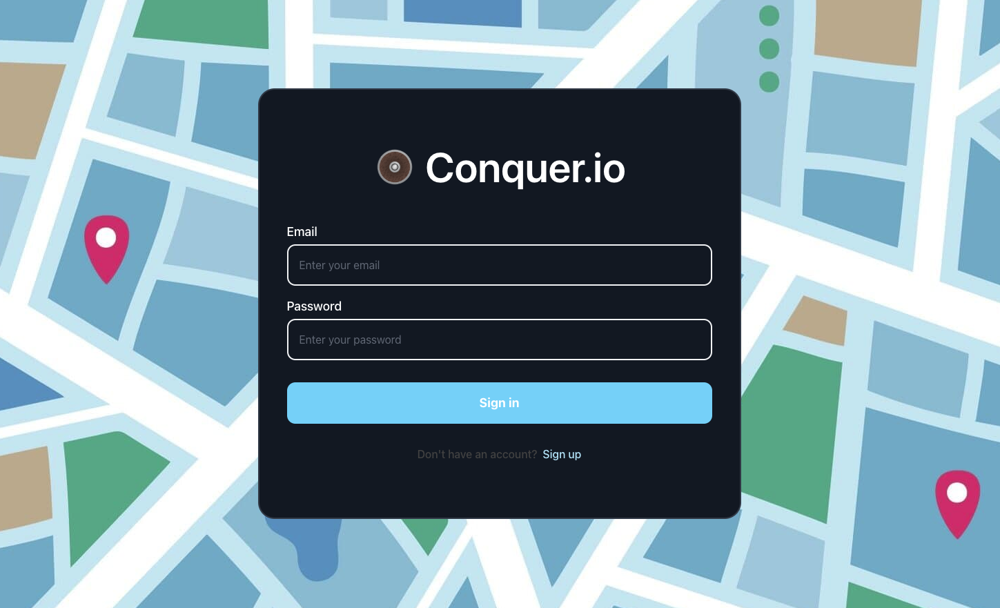
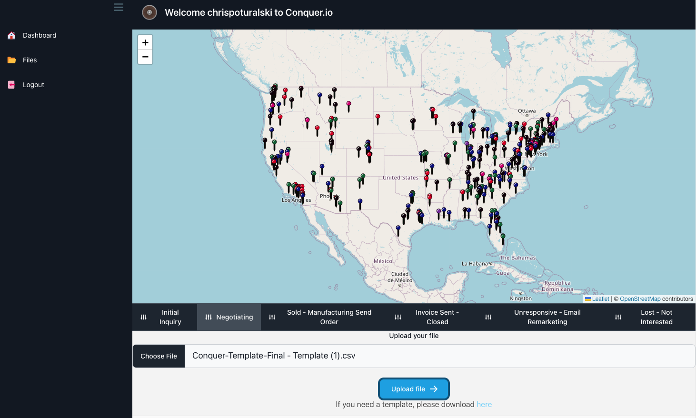

# Conquer.io

## Table of Contents

- [Description](#description)
- [Instructions](#instructions)
- [Usage](#usage)
- [Credits](#credits)
- [Contributers](#contributers)
- [Technologies](#technologies)
- [Questions](#questions)

## Description

AS A company that sells products across the United States
I WANT to have an application that will allow me to track where all of my products buyers are, see which ones I have done business with, and see which ones are no longer interested in my product
SO THAT I can assess where I can cut out a marketing budget and focus on the spread of my product.

Here is the deployed link to the project: https://conquerio.herokuapp.com/

## Instructions

In order to get started, you must clone the repository and then run 

'npm i'

to install your dependencies.

## Usage

For businesses who depend on B2B models or for personal leisure, Conquer.io is a upcoming technology that is able to map out databases, CRMs, random addresses and allow you to pinpoint them on a map. 

Managing sales data from a CRM can be challenging for businesses. It’s difficult to get a clear picture of the sales pipeline and track progress overtime. 
Sales managers often spend a lot of time manually compiling reports and analyzing data in order to make informed decisions.
It’s hard to know which lead has the highest value without visual reports.

## Credits

Chad Tao & Nick Graffis

## Contributers

Sam Ezad | [Github](https://github.com/samezad27) 
Chris Poturalski | [Github](https://github.com/chrispoturalski) 
Samer Mahir | [Github](https://github.com/samermahir) 
David Martin | [Github](https://github.com/David8127?tab=repositories) 
Robert Morales  | [Github](https://github.com/Robmor1100) 

## Technologies 

Front end Technologies and libraries
  HTML, CSS, JavaScript, React, Axios
  Bulma, flowbite, Tailwindcss - Styling and formatting
  React-router-dom & Jotai  - State management and page navigation
Leaflet:  JS library that we used to build and style our maps

Back end Technologies and libraries
  Sequelize - ORM to handle database synchronization & migration
  Node.js, Express.js 
  MySQL - Database used to house User and CSV file data.
  bcrypt
Papa Parse: CSV to JSON parser

## Questions

To view all of our projects, you can view them on our Github profiles

If you have any questions about my project, you can reach any of us via email

